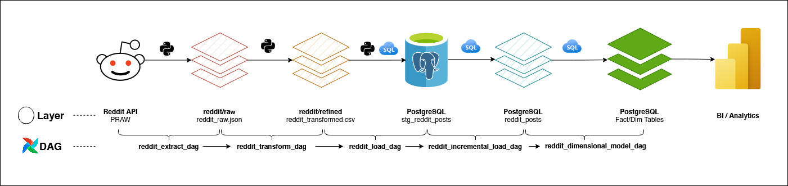

# Reddit Data Pipeline using Apache Airflow (Astro)

This project demonstrates an **end-to-end data engineering pipeline**
built using **Apache Airflow (Astronomer Runtime)** to extract Reddit
data, transform it, load it into PostgreSQL, and model it using
dimensional modeling principles.\
The project is designed to be **production-style**, modular, and secure.

------------------------------------------------------------------------

## 🚀 Architecture Overview

**Flow:**\
Reddit API → Raw JSON → Refined CSV → Staging Table → Incremental Load →
Fact & Dimension Tables → Cleanup



**Core Components:** - Apache Airflow (Astro CLI) - Reddit API (PRAW) -
PostgreSQL (Airflow-provided) - Pandas / PySpark-style transformations -
SQL-based dimensional modeling

------------------------------------------------------------------------

## 🧰 Prerequisites

### 1️⃣ Install Docker

Ensure Docker Desktop is installed and running.

👉 https://www.docker.com/products/docker-desktop/

------------------------------------------------------------------------

### 2️⃣ Install Astro CLI

#### Windows (PowerShell)

``` powershell
winget install -e --id Astronomer.Astro
```

Verify:

``` bash
astro version
```

------------------------------------------------------------------------

## 📁 Project Setup

### 3️⃣ Clone the Repository

``` bash
git clone <your-github-repo-url>
cd <project-folder>
```

------------------------------------------------------------------------

### 4️⃣ Start Airflow (Astro)

Run this **from the project root directory** (where `astro-project.yaml`
exists):

``` bash
astro dev start
```

This will: - Start Airflow Webserver - Start Scheduler - Start
PostgreSQL (Docker) - Mount dags/, include/, data/ folders

Airflow UI: 👉 http://localhost:8080\
Username: `admin`\
Password: `admin`

------------------------------------------------------------------------

## 🔐 Secure Configuration (VERY IMPORTANT)

### 5️⃣ Create Reddit API Connection

**Airflow UI → Admin → Connections → Add Connection**

-   **Conn ID:** `reddit_api`
-   **Conn Type:** `Generic`
-   **Login:** `<client_id>`
-   **Password:** `<client_secret>`
-   **Extra (JSON):**

``` json
{
  "user_agent": "python:DataAnalyzer:1.0 (by /u/your_reddit_username)"
}
```

✅ This keeps secrets out of code

------------------------------------------------------------------------

### 6️⃣ Create Dynamic Reddit Config Variable

**Airflow UI → Admin → Variables → Add Variable**

-   **Key:** `reddit_config`
-   **Value (JSON):**

``` json
{
  "subreddits": ["relationshipindia", "india", "mentalhealth"],
  "post_type": "new",
  "limit": 1000
}
```

------------------------------------------------------------------------

## 🛑 PostgreSQL Port Conflict Fix (Windows)

Before starting Astro, **STOP any local PostgreSQL service** on port
`5432`.

### Option 1: Services

1.  Win + R → `services.msc`
2.  Stop:
    -   `postgresql-x64-*`

### Option 2: Command Line (Admin)

``` powershell
net stop postgresql-x64-15
```

------------------------------------------------------------------------

## 🐘 PostgreSQL Setup (Airflow Provided)

### 7️⃣ Create PostgreSQL Connection

**Airflow UI → Admin → Connections → Add Connection**

-   **Conn ID:** `postgres_reddit`
-   **Conn Type:** `Postgres`
-   **Host:** `your_hostname`
-   **Schema:** `af_reddit`
-   **Login:** `your_id`
-   **Password:** `your_password`
-   **Port:** `5432`

------------------------------------------------------------------------

## 🧩 DAGs Overview

### 1️⃣ reddit_extract_dag

-   Extracts Reddit posts using PRAW
-   Stores raw JSON files
-   Uses secure Airflow connection

### 2️⃣ reddit_transform_dag

-   Reads raw JSON
-   Applies sentiment & intent logic
-   Writes refined CSV
-   Gracefully succeeds even if no files exist

### 3️⃣ reddit_load_dag

-   Loads refined CSV into `stg_reddit_posts`
-   Uses Airflow Postgres hook

### 4️⃣ reddit_incremental_load_dag

-   Inserts **only new posts**
-   Deduplicates using Reddit post ID

### 5️⃣ reddit_dimensional_model_dag

Creates: - `fact_reddit_posts` - `dim_subreddit` - `dim_author` -
`dim_raw_source_file` - `dim_refined_source_file`

### 6️⃣ reddit_cleanup_dag

-   Truncates staging table
-   Deletes raw & refined files (adhoc)

------------------------------------------------------------------------

## 🧱 Core Tables

### 1️⃣ stg_reddit_posts

- Staging table that stores raw Reddit post data ingested from the source files with minimal transformations, used for data validation and cleansing before further processing.

### 2️⃣ reddit_posts (Unique Records)

- Deduplicated intermediate table that retains only unique Reddit posts based on business keys, ensuring no duplicate records flow into downstream fact tables.

### 3️⃣ fact_reddit_posts

- Fact table containing the core measurable Reddit post data (such as scores, comments count, sentiment, and timestamps), linked to dimension tables for analytical reporting.

### 4️⃣ dim_author

- Dimension table that stores unique Reddit author details, providing descriptive context for analyzing posts by user.

### 5️⃣ dim_subreddit

- Dimension table that captures subreddit metadata, enabling analysis of Reddit posts by community or topic.

### 6️⃣ dim_raw_source_file

- Dimension table that tracks metadata of raw ingested source files, supporting data lineage, auditing, and ingestion traceability.

### 7️⃣ dim_refined_source_file

- Dimension table that stores metadata for refined/processed source files, enabling end-to-end data lineage tracking from raw ingestion to curated datasets.

------------------------------------------------------------------------

## 🧠 Warehouse Design Decisions

-   **Reddit ID** used as natural key
-   URLs kept in fact table (high cardinality)
-   Dimensions kept slim (best practice)
-   Incremental loads for scalability
-   Cleanup isolated into its own DAG

------------------------------------------------------------------------

## ▶️ How to Run the Project

1.  Start Docker
2.  Run:

``` bash
astro dev start
```

3.  Open Airflow UI
4.  Configure connections & variables
5.  Trigger DAGs in order:
    -   extract → transform → load → incremental → dimensional → cleanup

------------------------------------------------------------------------

## 📊 Future Enhancements

-   Power BI dashboards
-   dbt transformations
-   Data quality checks
-   CI/CD for DAGs
-   Schema evolution handling

------------------------------------------------------------------------

## 👤 Author

**Yash Tare**\
Data Engineer\
Tech Stack: Airflow \| Python \| SQL \| PostgreSQL \| Azure \|
Databricks

------------------------------------------------------------------------

⭐ If you like this project, give it a star on GitHub!
